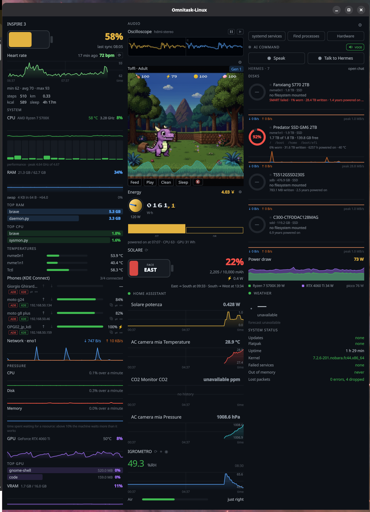
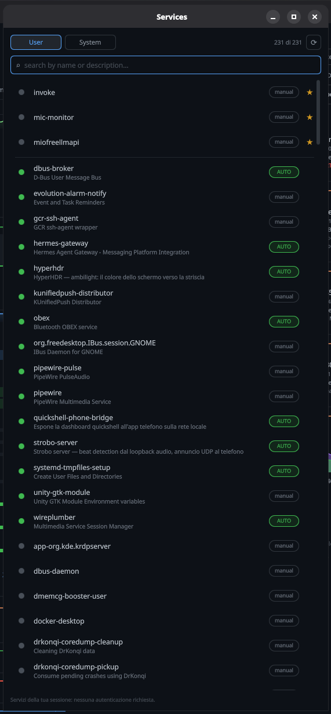
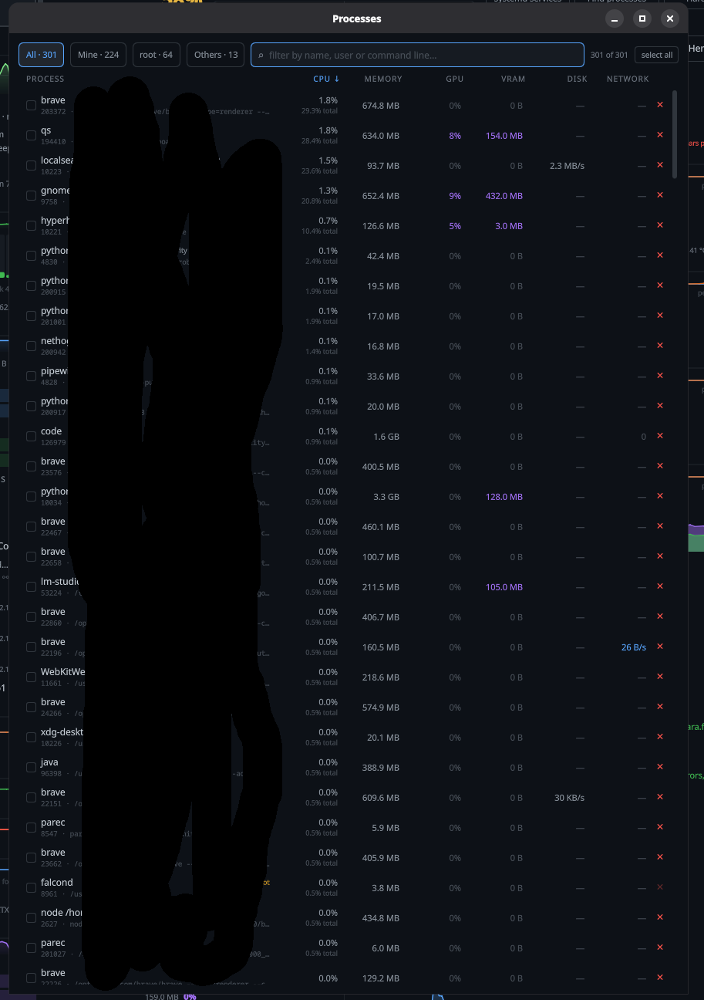
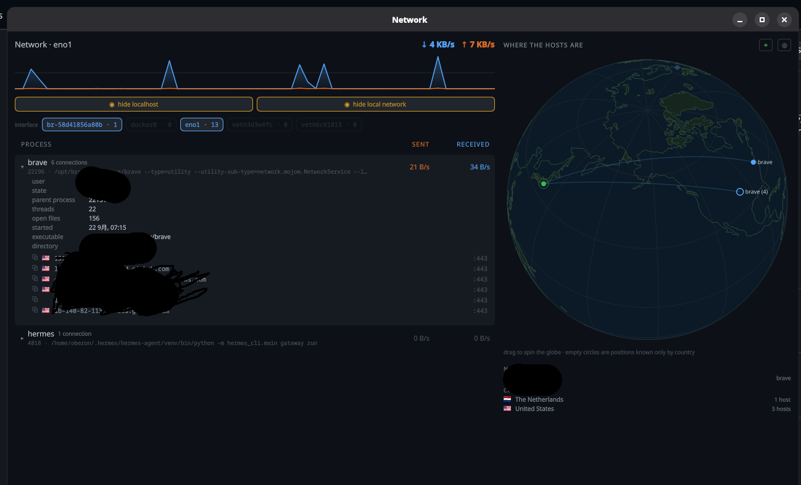
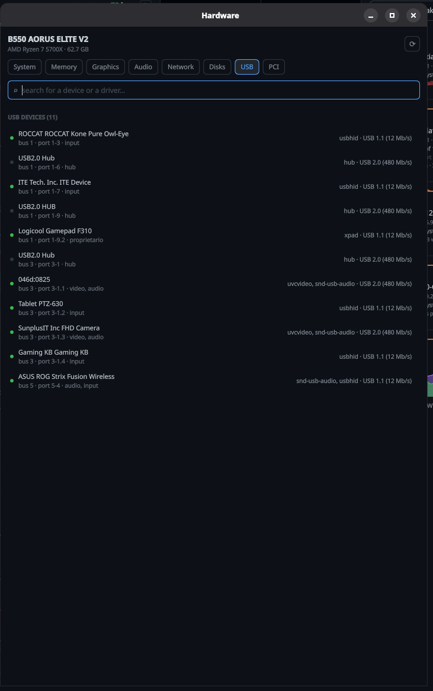
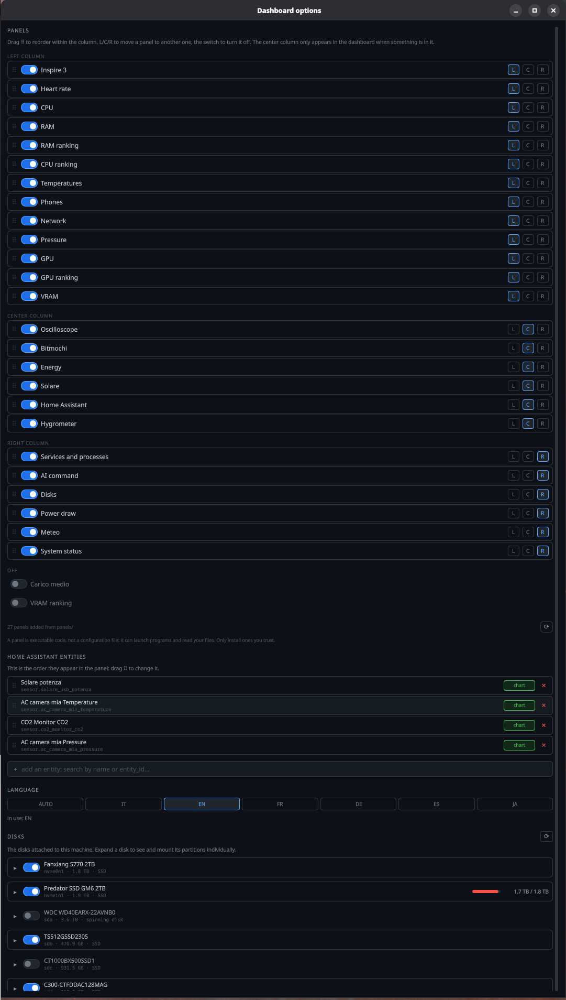

# Omnitask-Linux

A fast, fully-configurable **system monitoring dashboard** built for [Quickshell](https://quickshell.outfoxxed.de/) — the desktop twin of the **Omnitask** phone app. It shows live CPU, RAM, GPU, disks, network and process data in a draggable, resizable window, with optional **Home Assistant** integration and an **AI command** bridge — all ready to be themed and rearranged to your liking.

> _Note: this project is written and documented in English for GitHub, but the interface itself is translated and can be switched to several languages (see [Localization](#localization))._

**Tested on one machine.** Omnitask-Linux is written and tested on a single computer running **Fedora/Nobara** (GNOME on Wayland), with an NVIDIA GPU and Home Assistant in Docker. It is plain QML + Python and plausibly runs elsewhere, but the other install paths below (Arch, Omarchy plugin, wlroots compositors) are provided, not verified.



## Screenshots

The secondary windows, opened from the Tools panel or from a panel's own buttons:

| **Services** — user & system units, search and per-row favourites | **Processes** — filterable by owner, with per-process GPU, disk and network |
| --- | --- |
|  |  |
| **Network** — per-process traffic and the world globe of the hosts | **Hardware** — every device with the driver the kernel bound to it |
|  |  |
| **Options** — layout, entities, language and disks, all live | |
|  | |

## Features

- **Live system monitoring** — CPU (per-core), RAM, GPU, VRAM, disks, temperatures, power draw and system pressure, sampled continuously.
- **Per-process visibility** — a full, sortable process list and per-process network/disk/IO breakdown.
- **Phone battery & clipboard** — battery level and connection state of the phones paired over KDE Connect, plus one-click clipboard transfer in either direction.
- **Hardware inventory** — motherboard, BIOS, CPU, RAM modules, graphics, sound and network cards, disks, monitors and every PCI/USB device, each with the driver the kernel bound to it.
- **Home Assistant panel** — show the state and history of any of your Home Assistant entities right on the dashboard.
- **Modular by construction** — every panel is a self-contained `.qml` file in `panels/`: drop one in and it appears in the Options window, ready to switch on. No rebuild, no registration — the same is true of the panels that ship with the dashboard.
- **Fully configurable layout** — add/remove panels, move them between three columns and reorder them, all live with no "Apply" button. The middle column only exists while something is in it: leave it empty and the dashboard is the same two even columns it always was.
- **Resizable & persistent windows** — window size and position are remembered across sessions.
- **Multilingual UI** — English, Italian, German, French, Spanish and Japanese.
- **Keyboard-accessible & scriptable** — show/hide and toggle panels via the `qs ipc` CLI or a desktop shortcut.
- **Backend free of dependencies** — all data collectors are pure Python **standard library** scripts (the only optional extra is `pynvml` for NVIDIA GPU stats).

---

## How it works

The project is a **Quickshell configuration**: a set of QML files that compose the UI, plus Python scripts that run as persistent processes and stream JSON lines that Quickshell reads in real time.

```
shell.qml            entry point — defines the windows + IPC handler
Dashboard.qml        the column layout that hosts the panels (the middle one appears only when used)
panels/              every panel, shipped and self-written alike — one file each
Settings.qml         panel discovery, layout and persisted configuration
SystemStats.qml      live local machine statistics (from sysmon.py)
HomeAssistant.qml    Home Assistant state (from the REST API)
Processes.qml        process list/actions (from procmon.py / procs.py)
NetworkPanel.qml     per-process network usage (from procmon.py)
scripts/             Python data collectors (stdlib only)
lang/                UI translations
world.json           land profiles for the world globe (generated by make_world.py)
```

### Backend scripts

| Script | Purpose |
| --- | --- |
| `sysmon.py` | Samples CPU/RAM/GPU/VRAM/temps/power/pressure/disks/SMART/updates and prints one JSON line per second. It also **accumulates energy**: the CPU package counter (RAPL), the GPU watts integrated over time, and a persistent counter in `energy.json` — what the [Energy](#the-panels) panel reads. |
| `procmon.py` | Samples every process (CPU, memory, disk and network throughput, GPU/VRAM) each cycle. |
| `procs.py` | Actions on a single PID: show details, search, `nice` priority and `signal`/`kill`. |
| `services.py` | Lists systemd user and system services as a single JSON document. |
| `kdeconnect.py` | Battery and connection state of the paired KDE Connect devices, merged from kdeconnectd and GSConnect; also `--send`/`--receive` for the clipboard. |
| `phone_adb.py` | ADB to the phones KDE Connect already knows: finds the wireless-debugging port over mDNS (and remembers the one that worked, so later connects skip the listen), pairs with the six-digit code, connects, lists and launches apps, reads what is on screen and taps a button by its label, sends taps/text/keys, takes screenshots, and reads back where the mouse cursor is. |
| `solar_meter.py` | Reads the USB tester wired to the solar panel by photographing its screen through `macrocam_web.py`, cross-checks the OCR against `P = V·I` and `R = V/I`, and publishes the result to Home Assistant. |
| `hygrometer.py` | Reads the analogue hygrometer through the webcam and publishes it to Home Assistant as `sensor.igrometro_umidita`. The eye is not its own: it imports `main.py` from the Igrometer project (OpenCV, red needle, hand-made calibration) and asks it for a single measurement, so calibration and CSV log stay the tool's. Run it with that project's venv interpreter — the only one with OpenCV. Exit 2 means «nothing to read» (webcam busy, needle out of frame, calibration missing), which is an outcome and not a fault. |
| `ha_history.py` | Deletes a single wrong reading from Home Assistant's recorder — the one behind the point you right-clicked on a chart. The REST API cannot: `recorder.purge` thinks in days and whole entities, so this goes into the recorder database itself, the same place the history API reads back from. It clears the `states` rows of that five-minute bucket (unhooking `old_state_id` first, as Home Assistant's own purge does), the `statistics_short_term` buckets that repeat the deleted value until the next reading, and recomputes the hour in `statistics` from what is left — `sum` and `state` of meters are never touched. Home Assistant runs as root in a container, so when the database is not writable from here the script ships itself into the container over stdin and runs there. |
| `ha.py` | The two functions that talk to Home Assistant — config and REST call — shared by `solar_meter.py` and `hygrometer.py`. Standard library only: the hygrometer runs under a venv that has OpenCV and nothing else. |
| `macrocam_web.py` | Asks the phone for a macro shot over HTTP, talking to [MacroCam Web](../macrocam-web) instead of `adb`. Finds the phone through KDE Connect, so only the key is configured; same return shape as `phone_adb.do_photo`, so callers cannot tell which road the picture came down. |
| `audioscope.py` | Reads the default sink's monitor through `parec` and prints one triggered waveform per frame, already reduced to a hundred-odd points. Follows the default sink when it changes, and says so; silence is a field, not a stream of zeros. |
| `panels.py` | Lists every panel in `panels/` — the shipped ones and any you added — with the mistakes that stop one from working. |
| `hardware.py` | One-shot inventory of the machine: DMI, CPU, RAM modules, PCI, USB, network, audio, disks, display outputs — with drivers. |
| `stenografa_ai.py` | Bridge between the dashboard and the [Stenografa](https://github.com/) AI daemon's local control socket. |
| `hermes_chat.py` | Voice chat with [Hermes](https://github.com/NousResearch), the agent running on this machine: takes the Whisper transcript to `hermes chat -q … -Q --continue`, so the answer comes from the agent with its own tools, memory and MCP servers — the dashboard's own among them. The conversation shown in the window is a local copy in `~/.cache/quickshell/hermes-chat.json`; the real memory is Hermes' session, which `reset` rotates instead of erasing. |
| `phone_bridge.py` | The [phone bridge](#phone-bridge): sits between the dashboard and the Omnitask phone app, holding the phones' connections and pushing what the dashboard already knows on the cadence each phone subscribed for. Nothing of its own to sample — every figure comes from the live dashboard via IPC. |
| `winplace.py` | Reads/restores window position via the GNOME "Window Calls" extension. |
| `make_world.py` | Regenerates `world.json` from Natural Earth 110m land data. |
| `tools.py` | Resolves the external binaries the other scripts call, honouring `~/.config/quickshell/tools.json` before `PATH`. |

---

## Requirements

- **Linux** with Wayland (GNOME/Mutter and wlroots-based compositors are supported).
- [**Quickshell**](https://quickshell.outfoxxed.de/) 0.2+ (0.3 recommended).
- **Python 3.9+** (installed on the vast majority of distros).
- Optionally: `smartctl` (disk health), `nvidia-smi`/`pynvml` (NVIDIA GPU), `lspci`/`lsusb` (`pciutils`/`usbutils`) and `dmidecode` for the Hardware window, `parec`/`pactl` (`pipewire-pulse` or `pulseaudio-utils`) for the Oscilloscope panel, and the **GNOME Window Calls extension** for window-position memory.
  Without `lspci`/`lsusb` the Hardware window still lists every device and its driver, straight from sysfs — it just shows numeric vendor and device IDs where those two would have supplied names.

No third-party Python packages are needed — every collector uses only the standard library.

---

## Installation

The easiest way is the provided installer. From inside this repository:

```bash
./install.sh
```

It will:

1. Check that `quickshell` and `python3` are present.
2. Copy the project into `~/.config/quickshell/dashboard` (the location Quickshell recognizes as a configuration).
3. Create a `.desktop` launcher entry.
4. Add an autostart entry so it launches at login.
5. Install the optional **SMART sudoers** file (asks for administrator privileges) so the Disks panel can read disk health.

### Installer options

```bash
./install.sh                  # full install (all extras)
./install.sh --yes            # also auto-approve dependency installs
./install.sh --no-deps        # only copy the files, don't touch dependencies
./install.sh --no-sudoers     # skip the SMART sudoers
./install.sh --no-autostart   # skip launching at login
./install.sh --no-launcher    # skip the .desktop menu entry
./install.sh --path ~/myshell # install into an alternative folder
./install.sh --help
```

### Installing Quickshell itself

The installer detects your distribution and, with `--yes`, installs Quickshell automatically where a package exists. If you prefer to do it by hand:

| Distro | Command |
| --- | --- |
| Fedora / Nobara / RHEL (COPR) | `sudo dnf copr enable errornointernet/quickshell` then `sudo dnf install quickshell` |
| Arch / Manjaro (AUR) | `paru -S quickshell-git` (or `yay -S quickshell-git`) |
| Debian / Ubuntu / openSUSE | build from source — see the [Quickshell docs](https://quickshell.outfoxxed.de/wiki/) |

---

## Omarchy plugin

The same code also ships as an [Omarchy](https://omarchyplugins.com/) shell plugin, so on
Hyprland the dashboard can be a real layer-shell surface instead of a floating window.
`manifest.json` declares two entry points:

| Kind | File | What it does |
| --- | --- | --- |
| `bar-widget` | `BarWidget.qml` | CPU load in the bar; click to open the dashboard |
| `panel` | `Panel.qml` | The whole dashboard as a panel surface |

Both reuse the standalone components unchanged — `Panel.qml` hosts the same `Dashboard.qml`
that `shell.qml` puts inside a window, and both share `PanelHost.qml` for the secondary
windows (Services, Processes, Network, Hardware, Options, Phone).

```bash
omarchy plugin add https://github.com/ghirardo-giorgio/Omnitask-Linux.git --enable
omarchy plugin validate "$PLUGIN_DIR"
omarchy-shell shell summon io.github.ghirardo-giorgio.omnitask-linux '{}'
```

Installing as a plugin does **not** replace the standalone mode: `install.sh` and
`quickshell -c dashboard` keep working exactly as before.

**The Python backends still apply.** The plugin bundles `scripts/`, and paths are resolved by
`PluginPaths.qml` relative to the plugin directory rather than through
`Quickshell.shellPath()`, which would resolve against the hosting shell. `python3` and the
tools listed under [Requirements](#requirements) must be present.

**No privileges are installed.** Unlike `install.sh`, the plugin never writes to
`/etc/sudoers.d/` — Omarchy's guidance is to avoid unnecessary privileges. SMART disk health
and the DMI memory table degrade on their own and print the exact command to run by hand; see
[Optional: smartctl disk health](#optional-smartctl-disk-health).

**Still to verify on a real Omarchy machine** (the public docs do not cover these): whether a
plugin may register its own `IpcHandler` — which the [MCP server](#mcp-server) depends on —
whether it may create the secondary windows, and whether `moduleName` isolates the QML
singleton names (`Settings`, `Query`, `I18n`, …) from the hosting shell's own.

---

## Running

```bash
quickshell -c dashboard
```

Or launch it from the applications menu, or let it autostart with your session (as configured by the installer).

### Control from the CLI / shortcuts

The dashboard exposes an IPC handler so you can drive it from the terminal or a keyboard shortcut:

```bash
qs ipc call dashboard toggle     # show/hide the dashboard window
qs ipc call dashboard status     # print "visible" or "hidden"
qs ipc call dashboard services   # toggle the systemd services window
qs ipc call dashboard processes  # toggle the processes window
qs ipc call dashboard network    # toggle the network window
qs ipc call dashboard options    # open the configuration window
qs ipc call dashboard panel cpu  # enable/disable a panel by id
qs ipc call dashboard winsize    # diagnostic: current window sizes
```

---

## Configuration

There is **no `Apply` button**: every change in the Options window is written to disk and reflected instantly.

**Panel layout & options** — file: `~/.config/quickshell/dashboard.json`

- Which panels are visible and in which column/order.
- Number of items in the "top" rankings, sample/history intervals, process poll interval.
- Temperature sensors and disks shown.
- Chart colors (custom colors for each data series).
- Remembered process priorities.
- Window sizes and positions.
- Network filters (hide loopback / hide LAN traffic). The per-interface filter in the Network window is not persisted — its choices depend on what's plugged in or on VPN right now, so they reset on restart.
- **Per-panel parameters** (`"panelParams"` section) — the values each panel used to keep hardcoded: warn thresholds, timeouts, chart spans. Each panel registers its defaults there on first run, so after one start of the dashboard the file lists everything it can tweak; edit a number and the change applies live (the file is watched). Deleting a key restores that panel's default at next launch.

**External tool paths** — file: `~/.config/quickshell/tools.json`

```json
{
  "adb": "~/Android/Sdk/platform-tools/adb",
  "smartctl": "/usr/sbin/smartctl"
}
```

Optional, and empty values mean "look it up in `PATH`, as before" — without this file nothing
changes. It exists for the case where a tool is installed **twice** and the dashboard needs the
other one: Fedora's `adb`, for instance, is built without mDNS (`adb mdns services` answers
`unknown host service`), while the one shipped with the Android SDK has it. `PATH` is not the
place to say so, because the dashboard's `PATH` is the session's, not the shell's — an `export`
in `.zshrc` never reaches it.

Known keys: `adb`, `avahi-browse`, `scrcpy`, `busctl`, `smartctl`, `nethogs`, `nvidia-smi`,
`pkcon`, `dnf`, `flatpak`. `~` and `$VARS` are expanded; a value without slashes is a *name* to
look up in `PATH` (so `"adb": "adb-google"` works). A single tool can also be overridden for one
run with an environment variable — `DASHBOARD_ADB=/path/to/adb`.

A path written here that does not exist never breaks anything: the dashboard falls back to
`PATH` and reports the reason in `phone_adb.py status` → `hints`, so a hand-written path can't
fail silently.

Note when pointing `adb` elsewhere: client and server must be the same version. The first call
with a different `adb` kills the running server and starts its own, so current wireless
connections drop and need a reconnect.

**Home Assistant** — file: `~/.config/quickshell/home-assistant.json`

```json
{
  "url": "http://homeassistant.local:8123",
  "token": "YOUR_LONG_LIVED_ACCESS_TOKEN"
}
```

The token is kept **outside the QML code and outside the dashboard settings file** on purpose.

All parameters are validated against safe ranges, so an out-of-range value can never silently corrupt the dashboard.

---

## The panels

Every panel is a single file in `panels/`, toggleable and placeable in any of the three columns (L/C/R in the options window). The dashboard ships with these 26:

| Panel | Shows |
| --- | --- |
| **Home Assistant** | State and history of your chosen HA entities (selectable buttons, charts toggleable per entity). |
| **CPU** | Total + per-core utilization. |
| **CPU ranking** | Top processes by CPU usage. |
| **RAM** | Memory usage bar. |
| **RAM ranking** | Top processes by resident memory. |
| **GPU** | GPU utilization (NVIDIA via NVML or `nvidia-smi`). |
| **GPU ranking** | Top processes by GPU load. |
| **VRAM** | Video memory usage. |
| **VRAM ranking** | Top processes by VRAM usage. |
| **Power** | Power consumption / draw. |
| **Energy** | What the computer has drunk since it was switched on, in watt-hours — the Power panel shows watts, a photograph; this one the integral, accumulated by [`sysmon.py`](#how-it-works) while it passes and persisted in `energy.json` across restarts. What is **measured** is the CPU package (the RAPL counter, exact) and the GPU (integrated from `nvidia-smi` watts); what is **estimated** is the rest of the machine (`baseWatts` × seconds) and the PSU losses (÷ `psuEfficiency`), both tunable in `panelParams` from the ⚙ in the panel header — so the big number is an estimate to the wall, deliberately stopping short of the monitor, which has its own plug and its own hours. The `seconds` counter says how much was actually measured: dashboard opened after boot (or the machine having slept) shows a note instead of pretending to have seen everything. Three instruments: the **meter disc** spinning at the current watts with the odometer reels beside it counting watt-hours in one direction only, and the **hourly bars** — one bar per hour of the day, the current one drawn outlined, baseWatts excluded so the bars only tell where the work was. The tariff fields (price, summer tariff and its months, currency — the yen gets no decimals) are `ParamField` rows that write straight into `panelParams` while you type, with no Apply button; the cost, the meter disc and the hours all pass through the same estimate, so the three instruments never disagree while looking at each other. |
| **Solar** | The power bank charged by the solar panel, drawn as a battery: it fills up as the day's mAh grow (capacity set in `panelParams`, default 10,000 mAh) and turns green when full. Amber and pulsing while the tester reports power flowing, with the live watts; fed by the `sensor.solare_usb_*` entities written by [`solar_meter.py`](#solar-panel--home-assistant). At the center of the battery, what to do about it: *posiziona a est/sud/ovest*, plus the two switch times of the day underneath (see [Where to point the panel](#where-to-point-the-panel)). |
| **Hygrometer** | The analogue hygrometer on the wall, read by the webcam every ten minutes (`hygrometer.py` under a systemd timer) and shown from Home Assistant, like the solar panel. The bar is coloured by comfort, not by scale: red below 30% and above 70%, amber on the way, green in the 40–60 band — what you actually look at a hygrometer for. Under the bar, the trend from Home Assistant's own recorder — the panel asks for that entity's history itself (`watchHistory`), without it having to be among the ones picked in the options. The ⟳ asks for a reading now; the ⌖ opens the calibration in a terminal and lights up amber on its own when the saved calibration lacks the dial radius and the program is estimating it. While the calibration window is open the webcam is busy and readings say so instead of failing. |
| **Inspire 3** | The Inspire 3 battery as Home Assistant reports it (`sensor.inspire_3_battery` by default, entity configurable in `panelParams`), drawn with the same horizontal gauge as Solar — one shape for every battery. The last-sync time sits under the percentage, so a number that has stopped moving says so itself. |
| **Weather** | Current conditions, outside temperature and the coming days, from Home Assistant's own weather entity — there is no city to set anywhere: that entity already sits on the home coordinates `sun.sun` and the Solar panel work from, so moving house is one change in Home Assistant and none here. The present state (condition, temperature, humidity, wind, UV) rides along with the normal state polling; the forecast comes from the `weather.get_forecasts` service, which since Home Assistant 2024.4 is the only place it lives — the `forecast` attribute is gone — and is only asked for while the panel is on screen. The next hours run across in a strip, the next days down in rows, with the rain in mm on the days that have any. With more than one `weather.` entity, name yours in the `entity` key of `panelParams`; `days` and `hours` decide how far ahead to look. |
| **Temperature** | Chosen temperature sensors. |
| **Pressure** | How long processes wait instead of work (load pressure), with 1-minute average. |
| **Heart rate** | Heart rate from the paired wristband, with today's steps/distance/calories/sleep (see the phone windows). |
| **System health** | Things that break silently: kernel, pending updates, uptime. |
| **Disks** | Usage gauges + SMART health for each disk (requires the sudoers file). |
| **Network** | Per-process network traffic (what `nethogs` does, inside the dashboard). |
| **Oscilloscope** | What is coming out of the speakers, drawn the way ProTracker and Winamp drew it. The capture ([`audioscope.py`](scripts/audioscope.py)) reads the default sink's monitor and follows it when the default changes — plug the headphones in and the trace moves with them, the name beside the title says which. The *trigger* — the rising zero-crossing the drawn window starts on — is what keeps the shape still instead of sliding sideways every frame, and it happens on the samples, before they are reduced to points, because that is the only place it can happen. Silence is a flat line and no redraws until sound comes back; the capture itself only runs while the panel is on screen (the monitor does not keep the sink awake — measured). `fps`, `points`, `windowMs`, `height` and a fixed `device` live in `panelParams`; right-click the trace to recolour it. |
| **AI command** | Two microphones side by side: **Parla** sends commands to the [Stenografa](https://github.com/) AI daemon (shortcuts, app launches, terminal); **Parla con Hermes** takes the same transcript to the Hermes agent instead — its own CLI, one continuous session, tools and approvals as configured in `~/.hermes/config.yaml`. An agent turn takes tens of seconds, so the panel counts them out loud; while Hermes answers, its button turns into *Ferma* and kills the whole process group, agent and tools together. When the answer lands, the chat window rises on its own (the same view via `qs ipc call dashboard hermes`). The panel keeps only a counter and an *open chat* link; *new conversation* inside the window clears the copy and opens a fresh session. |
| **Bitmochi** | A pixel pet living in the column: it hatches from an egg, walks its room in real time, gets hungry, dirty and tired, grows through baby and child into one of three adults decided by how well you looked after it — and dies if you forget it for about fourteen hours, leaving a memorial card and a new egg one generation up. The four buttons feed it, play with it, clean up and put it to sleep; clicking the pet itself pets it. Nothing runs in the background: every stat is computed from how long it has actually been the moment you next look, so the pet keeps living while the shell — or the computer — is off. `roomHeight` in `panelParams` (default 280 px) sets how tall the room is, the fixed rows above and below it size themselves. The game is [Bitmochi](https://github.com/Gsirawan/Bitmochi) by Ghaith Alsirawan, MIT, written for the Omarchy shell and ported into this dashboard — see [`pet/UPSTREAM.md`](pet/UPSTREAM.md) for exactly what was changed. Beyond the game's own four stats you can add **traits of your own, each wired to a sensor**: any numeric Home Assistant entity, or a measure the dashboard already samples (CPU/GPU temperature, RAM, watts, any hwmon probe, or **how many phones ADB can see right now**). A trait is a range and a safe band — CO₂ from 400 to 2000 ppm, well up to 800, unwell past 1600. The pet's own four stats read as one row of icons at the top of the panel (🍗 hunger, ⚡ energy, 😊 happiness, 🧼 hygiene, the numbers in Press Start 2P): no bars, so the room keeps the height they used to cost. A trait does not kill on its own: it **moves the game's own four stats**. Give it a weight in points per hour for hunger, energy, happiness or hygiene, and good air recharges while bad air drains — the sign reverses it, so a trait can leave the pet livelier and hungrier at once. When a stat hits zero the pet falls ill by the rule the game has always had, and dies twelve hours later: one mechanic, the original one, so airing the room is a way of keeping it alive. For scale, the game drains 12–25 points per hour by itself. A sensor that stops answering reads `n/a` and applies nothing at all. A trait can also **drop an object into the room** instead of only feeding the stats: a chilli when the CO₂ stays past its threshold for so many minutes, an apple every so many units the sensor climbs — "rises by 500 mAh" gives one apple per 500 mAh of charge, where a threshold would give one per charge. With `sys:adbPhones` and a step of 1 that same mechanic becomes an event: every phone that attaches to ADB drops one object, and one that goes away drops nothing. It only counts in the direction you pick, a jump larger than four steps is read as a reset rather than as a gift, and the pet has to walk over the object to collect it: that it often does not is the mechanic, not a fault. A **card** appears at the top of the room saying which sensor sent it — «🔋 Solare carica +500 mAh» — and fades after four seconds, because with several traits wired up an object that just appears is a surprise rather than a reading. There are **sounds**, too: a rising chime a second and a half *before* a bonus falls (a falling one for a malus, which is what buys you the time to look up), a thud when it lands and a coin when the pet collects it. They are square waves generated by `scripts/make_sfx.py` rather than downloaded, so there is no licence to carry, and the 🔊 button next to the four care buttons turns them off. The ⚙ in the panel header opens the window that wires them up ([Pet traits](#extra-windows)), and they live in `~/.config/quickshell/pet-traits.json`, editable by hand while the shell runs. A trait can also be drawn. Mark it *molecules*, pick the molecule — CO₂ linear, H₂O bent at 104.5°, O₃, CH₄, a diatomic, or a single speck for dust — and choose the three colours (atoms, centre, bonds); they are yours and never shift. How many appear is counted in the sensor's own units: **one molecule every N ppm above a baseline**, so 400 ppm of outdoor air draws nothing and every 50 ppm past it adds one, up to a cap. They tumble slowly, each at its own rate, and pool near the floor when there are few, rising as they accumulate — because CO₂ really is heavier than air. The floor can be a **graph**: pick a series in the traits window — any trait's Home Assistant history, or the CPU/RAM/GPU the dashboard already samples — and the pet walks over its relief, smoothed with a Catmull-Rom spline. The hills are the hours the room stayed shut. Its colour and opacity are yours to pick. A **backdrop** image can go behind the whole panel (`background` in `panelParams`) with an adjustable veil over it so the text stays readable; any size works — smaller than the panel it is enlarged by a whole number with crisp pixels like the sprites, larger it is shrunk smoothly. To draw it as pixel art, 256 × 160 px. Off by default. |
| **Phones** | Battery level and connection state of the devices paired over KDE Connect, with ↑/↓ buttons to send the clipboard to a phone or pull it back. Off by default. |
| **Tools** | One-click buttons to open the Services, Processes and Hardware windows. |

A twenty-second file, `CaricoMedio.qml` (load average), is not part of the set: it is the worked example behind [Writing your own panel](#writing-your-own-panel), kept in the folder so it can be switched on like any other panel — and deleted like one.

### Extra windows

- **Services** — systemd user & system services, start/enable state. The star at the end of a row keeps that service at the top of the list, above a thin rule and ahead of the other two hundred; searching narrows the list without disturbing that order. Favourites are per scope (user and system are two lists) and live in `favServices` in the config file.
- **Processes** — full sortable process list filterable by owner (all / mine / root / **other users**, that last one being the service daemons that each run as their own user — dbus, avahi, polkitd — thirteen rows buried among three hundred), plus per-PID actions: search, details, priority (`nice`) and `kill`/signal. The list stays where you put it: the order stops rearranging while the pointer is over it or while rows are selected, and the scroll position survives every sample. That last one is less obvious than it sounds — the model is a JavaScript array rebuilt each cycle, and reassigning it is not an update but a reset, all rows removed and re-added. The position went with them, so with a few hundred processes you could never reach the bottom. Catching it afterwards does not work either: the view's reset is C++ that runs *before* the QML handler, so by then the position to save already reads zero. The fix is to own the moment — the model is copied by hand when the results change, so the position can be put aside while it is still the real one.
- **Network** — per-process traffic with in/out per connection and its counterpart address. The system-wide total follows the current default route rather than an interface fixed at startup, so bringing up a VPN moves the graph onto the tunnel by itself. It deliberately does *not* sum every interface: a tunnel's traffic also crosses the NIC that encapsulates it, and a container's also crosses both its veth and its bridge, so summing would count the same bytes twice. When more than one interface is carrying traffic, the per-connection list can be filtered by interface, and the globe places the observer at the VPN's exit — geolocated from the tunnel endpoint found in the local routing table, still without contacting any external service.
- **Hardware** — what the machine is made of, in eight categories (system, memory, graphics, audio, network, disks, USB, PCI), searchable by device or driver name. Every device carries the driver bound to it, and one that has none says whether a module for it exists but was never loaded — the difference between broken and merely not set up. Read once on first open and on demand from the ⟳ button: an inventory is not a measurement, and nothing here changes while you look at it except what you plug in.
- **Options** — the configuration window for layout and parameters.
- **Pet traits** — wires sensors to the pet's extra stats. Type into the search box and it offers both Home Assistant entities and the dashboard's own measures, filtered to the ones that are actually numeric — a switch that reads `on`/`off` has no range and is not offered. Picking one creates the trait already configured: a `ppm` sensor arrives as 400–2000 with molecules switched on, `°C` as 20–100, and anything unrecognised gets a range built around its current reading. Under the thresholds each row draws the **wellness profile** across the whole range, with a mark on the current value: it is what shows that the four numbers are not a duplicate but the two ends of two ramps, and it turns into a vertical wall the moment you set a pair equal. Below that, the four weights, each with the effect it is applying *right now*. A trait with molecules on gains one more row: the molecule itself, its three colours, and how many sensor units one molecule is worth — with a live preview drawn by the very component the room uses. Each row shows what the sensor says **right now** and the wellness that comes out of it, so a wrong entity is obvious before you close the window.

### World globe

The dashboard also includes a **world globe** (`WorldGlobe.qml`) that plots the network hosts the machine is talking to. It uses an orthographic projection framed on the hosts (not on the observer), so the interesting hemisphere is always visible. Land profiles come from `world.json` (generated offline by `make_world.py`, no network needed at runtime).

---

## Localization

The interface is translated and stored in `lang/` (JSON files):

- English (`en`)
- Italian (`it`)
- German (`de`)
- French (`fr`)
- Spanish (`es`)
- Japanese (`ja`)

The language is chosen in Settings; an empty value uses the system locale.

---

## Writing your own panel

Every module of the dashboard is a `.qml` file in `panels/` — the 26 shipped above and anything you add are the same kind of beast, discovered by the same scan at startup and listed in the same Options window. Put a file there and it shows up switched off, ready to enable; delete it and the panel is gone (the layout slot says so instead of leaving a silent gap). Nothing else to edit: there is no second catalogue anywhere in the code. The ⟳ button next to the panel list rescans without a restart.

Three rules, and the first is the one that costs an evening if nobody tells you:

1. **The file must start with `import ".."`.** Quickshell registers singletons per *configuration directory*, and a subdirectory is not that directory. Without the import the panel loads perfectly and every singleton reads `undefined` — measured: `cpu=undefined` without it, `cpu=17.9 lingua=it intervallo=2000` with it. `panels.py` checks for the line and the Options window says so if it is missing, because it is not a mistake anyone guesses.
2. **The filename must start with a capital** — QML will not instantiate a component whose type name is lowercase.
3. **The root item sizes itself.** Inside the dashboard's `Loader` a panel's `Layout.*` are ignored; what counts is `implicitHeight`.

`import ".."` brings in the dashboard's own singletons and components — `SystemStats`, `Settings`, `I18n`, `StatBar`, `Sparkline`. Quickshell's own modules still need importing by name (`import Quickshell.Io` for `FileView`, `Process`, and so on).

Two optional declarations refine how the panel presents itself:

- `property string panelTitle: "…"` chooses the name shown in Options; otherwise the filename is used, `CaricoMedio.qml` becoming *Carico Medio*.
- `property string panelId: "…"` chooses the identifier under which the panel is remembered in `dashboard.json` (the column lists cite it). Without it the id is `"user:" + filename` — unique by construction, but verbose; the shipped panels all declare short ids (`"cpu"`, `"disks"`…), and ids must be unique across the folder: two files claiming the same one get the second rejected with an explicit error.

A panel that will not compile cannot take the dashboard down with it: the `Loader` reports the failure, the exact line and column go to `qs -c dashboard log`, and a warning appears where the panel would have been.

### Panel parameters in the config file

Values that a user might want to change — thresholds, timeouts, chart spans — do not belong hardcoded in the panel. They go through `Settings` into the `"panelParams"` section of `dashboard.json`:

```qml
// defaults stay in the panel; the values themselves live in the config
readonly property var defs: ({ warnPct: 90 })
readonly property real warnPct: Settings.panelParam("ram", "warnPct", defs.warnPct)

Component.onCompleted: Settings.declarePanelParams("ram", defs)
```

`declarePanelParams` writes any key not already present into the file on first run, so after one start of the dashboard every tunable is visible and editable without reading source:

```json
"panelParams": {
    "ram": { "warnPct": 85 },
    "heart": { "minSpanBpm": 20 }
}
```

Edits apply live (the file is watched); deleting a key falls back to the panel's default at next launch. `Settings.setPanelParam(id, key, value)` exists for writing from an interface. The worked example `panels/CaricoMedio.qml` uses exactly this pattern for its polling interval.

### Installing over an existing setup

The installer keeps `panels/` out of its `rsync --delete` pass so reinstalling never wipes your own files, then makes a second copy-only pass that ships and updates the built-in panels. A panel modified *in place* counts as part of the dashboard and is overwritten by a reinstall — personal work belongs in a file of your own.

**A panel is a program, not a settings file.** It can start processes, read your files and reach the network, with your permissions and no sandbox — exactly like the panels shipped here. Installing someone else's panel means running their code. The Options window says this out loud rather than pretending these are data.

---

## Optional: smartctl disk health

To let the Disks panel read SMART data (requires `smartctl`), the installer installs the sudoers file for you. To do it manually:

```bash
sudo install -m 0440 -o root -g root \
  scripts/quickshell-smart.sudoers /etc/sudoers.d/quickshell-smart
sudo visudo -c
```

Without it the dashboard still works — the Disks panel just shows a reminder instead of the health data.

With it, `health` in the MCP server also gains a per-disk verdict: `failing` when the drive's own self-assessment has failed, `warning` when it still claims to be fine but has pending or reallocated sectors, media errors or an exhausted spare pool. The second case is the one worth having — the pass/fail thresholds are set by the manufacturer and sit a long way out, and a disk with an unreadable sector routinely still reports PASSED.

---

## Optional: RAM module details

Make, part number and speed of the memory modules live only in the SMBIOS table, which the kernel exposes with `0400` permissions and no fallback. To let the Hardware window read it:

```bash
sudo install -m 0440 -o root -g root \
  scripts/quickshell-hardware.sudoers /etc/sudoers.d/quickshell-hardware
sudo visudo -c
```

Without it the Memory category still shows the total from `/proc/meminfo`, plus this command in place of the per-slot detail. What it buys: how many slots the board has and how many are filled, and whether a 3600 MT/s module is actually running at 2133 because XMP is off.

---

## Optional: phone battery over KDE Connect

The **Phones** panel (off by default — turn it on from Options) shows the battery level and connection state of the devices paired with this machine. Nothing to install if you already use KDE Connect or GSConnect.

Which daemon answers matters:

- **kdeconnectd** exposes one D-Bus object per plugin, battery included, so the percentage comes from there.
- **GSConnect**, in recent versions, publishes only the `Device` interface over D-Bus — name, type, connected, paired. Its plugins live inside the shell menu as GMenu entries rather than properties, so the battery cannot be read from it at all. The panel says so instead of leaving a blank.

Both are queried and their lists merged, rather than using the second only as a fallback: they can run side by side, and a phone paired with just one of them exists only for that one. They use the same device id for the same phone, so merging is a matter of preferring the entry that also carries the battery.

The panel is polled only while it is on screen, every 30 seconds — a battery percentage moves a point every several minutes, and staying subscribed to the bus would mean a live process for a value that changes that slowly. Switching the panel on asks the daemon to re-announce itself on the network first (`forceOnNetworkChange`), which is how a phone paired a minute ago shows up without waiting; double-clicking the panel does the same on demand. The periodic poll stays a pure read.

A device that is paired but switched off reports **no** battery rather than zero, and says which of the two it is: a missing percentage is not a flat battery.

### Clipboard, both ways

Two arrows sit next to each phone's name: **↑** sends this machine's clipboard to the phone, **↓** pulls the phone's clipboard back here. They are the only things in this feature that *write* anything, they live behind explicit `--send`/`--receive` arguments in the collector, and they are never reachable from the read path — the same separation `Query.qml` keeps between `answer` and `act`. The MCP server calls only the read: a clipboard is something you push by pressing a button, not by asking a question.

The two directions are not equally available, and it is not a matter of taste:

- **Sending** works through either daemon. kdeconnectd's `sendClipboard()` is preferred when it knows the device.
- **Receiving** only works through GSConnect's `clipboardPull` action. kdeconnectd exposes `sendClipboard()` and nothing else — the inbound direction is opened by the phone, not requested by the desktop.

Whether a given phone can do either is asked of the phone rather than deduced from which daemon lists it. That distinction was measured, not assumed: a phone paired with kdeconnectd but *not* with GSConnect still appears in GSConnect's list, with six actions instead of thirty-three and neither clipboard action among them. Deducing the capability would have drawn a working-looking arrow that answered `Unknown action 'clipboardPull'` on click. An arrow that cannot work is drawn dimmed and says why when clicked, rather than disappearing — a control that vanishes leaves you wondering whether it was ever there.

### Two links, two lights

ADB and KDE Connect reach the same phone down separate channels, and knowing about one says nothing about the other. A phone on the end of a USB cable answers `adb` perfectly while KDE Connect calls it unreachable, because the app on the handset is not open. The panel used to show only KDE Connect's half of that, so the row read **non raggiungibile** and looked like a phone that was switched off — with no way to tell that the other channel was fine, or which of the two needed turning on.

So each row now carries two small badges, `ADB` and `KDE`: green when the link is up, red when it is not, amber for *there but not usable* (an ADB device waiting for its RSA prompt to be confirmed), grey while the first reading is still on its way — because *not known yet* is not *not connected*. Three letters rather than two dots, since two dots side by side would not say **which** link is missing, and that is the entire point. Hovering says what to switch on. The words that used to sit there are gone: the red badge already says unreachable, and the line is better spent on the address, which is what you want in front of you while working out why it will not connect.

The ADB half costs a `phone_adb.py status --quick` every thirty seconds while the panel is on screen — `adb devices` merged with KDE Connect's list, no mDNS listen at all: **386 ms against about three seconds**, which is the difference between a badge that can be refreshed on the battery's own cycle and one that cannot. What that gives up is the wireless-debugging announcement and the pairing window, so the answer carries `discovered: false` and the hints that depend on having listened stay out of it rather than being reported as absent. It runs in a process of its own rather than in the command queue: that queue belongs to the phone open in the window, and a panel badge has no business queueing behind a screenshot.

The panel still lists what KDE Connect knows, not what ADB knows. A phone attached by cable to a machine that never paired with it is not a row here, and giving it one would quietly turn *Phones* into a different panel.

### The address, and the screen behind it

Each phone's addresses carry a **⧉** that copies them — the same gesture and the same 1200 ms confirmation as the Network panel, because it is the same job: an address is something you paste into a ping, an `adb connect` or a firewall rule. The icon appears only when that line is actually showing addresses; when it is showing an error or the reason a battery is missing, there is nothing worth copying.

**Double-clicking a phone** opens a window with its screen: the picture, the navigation keys, screen on/off, and unlock. The screen button uses `SLEEP`/`WAKEUP` rather than `POWER`, which is a toggle and would turn an already-dark screen back on; switching the screen off also clears the picture, since a stale photograph of a lit screen is worse than none. It is a sequence of photographs rather than a mirror — **Segui** keeps them coming at about two a second, and with it off one is taken after every gesture, so what is on screen is always the result of the last thing you did. Clicking the picture taps the phone at the corresponding point; the conversion carries no hardcoded numbers, taking the real resolution from the screenshot's own `sourceSize` and the scale from `paintedWidth`, so a rotated phone or a resized window corrects itself.

The gesture is decided on release, the way a phone decides it: still and brief is a tap, still and long is a long press, moving is a real drag sent as `down`/`move`/`up` — a single `swipe` would reach Android as a fling, and dragging an icon would be impossible. The mouse wheel scrolls, and the keyboard types into the phone while the window has focus: letters are batched every 120 ms (one round trip per letter would be one round trip per letter), Esc is Back, Ctrl+H Home, Ctrl+J the app switcher, F5 a fresh capture. Text is quoted before it leaves: `adb shell` reassembles its arguments into a line that a shell reads on the other side, so an unquoted `;` in a message would run as a command on the phone.

Behind it sits `phone_adb.py live`, one process that stays open for as long as the window does — it captures on a timer and takes gestures on its standard input, which is what makes a tap cost 50 ms instead of the 250 ms of starting python and adb afresh. Frames land alternately on two files in `XDG_RUNTIME_DIR`, named after the process so two windows never overwrite each other, and both are removed when the session ends. **Segui** pauses itself after a minute without interaction: nobody is watching, and the captures are paid for by the phone's battery.

Capture goes the fast way round: `screencap` without arguments, gzipped on the phone and repacked into a PNG here. Letting the phone compress the PNG costs 1.4 s on a photographic wallpaper against 0.8 s this way, of which 35 ms is the local repacking — the phone's CPU is the scarce one. A phone whose pixels come in some other format falls back to `screencap -p`, once, not once per frame.

Two things this cannot do, and the reason is the same both times: **there is no real-time video and no pinch**. `screenrecord` piped into ffmpeg emits nothing at all until the pipe closes (tried with every low-latency flag, and with `-c:v copy` so no decoding was involved), and `input` has a single pointer while writing to `/dev/input` is denied by SELinux even to adb's shell — a two-finger gesture needs code running on the phone that injects multi-pointer events. That is what scrcpy is, and it is what the **Mirroring** button opens (`sudo dnf install scrcpy`): 60 fps, real drag, pinch, keyboard and clipboard, in a window of its own. Opening it pauses **Segui**, since two captures of the same screen are battery spent twice.

Mirroring now opens with `--mouse=uhid`, and that one flag buys a reading that is otherwise impossible: **where the pointer is**. Android remembers a touch only while the finger is down — a moment after it lifts, `dumpsys input` answers `no displays touched` and the coordinates are gone for good. A cursor is different, it stays where it was left, but a cursor exists only if the phone believes it has a mouse. In `sdk` mode scrcpy injects clicks through the framework API and the phone never learns of any mouse; `uhid` mounts a real HID one through the kernel's UHID module, over Wi-Fi as happily as over USB, and from then on there is a pointer to ask about. `phone_adb.py pointer` returns it in screen pixels, ready to hand straight back to `tap`.

Finding it took some looking. The obvious place is `dumpsys input`, which does print a `PointerController` block and a full `Cursor Input Mapper` for the scrcpy device — sources, motion ranges, display id, button state, whether it is down — and stops just short of saying where it is. On Android 14 the position is not in that dump at all. It is in SurfaceFlinger: the cursor is drawn as a sprite layer named `Sprite`, and the layer list carries its `pos=(x,y)`. The dump runs past five thousand lines, so the `grep` is done on the phone and only a handful of lines cross the network — 130 ms end to end. The price of the flag is that scrcpy's window captures the PC's mouse and moves it in relative mode; LAlt or Super gives it back, and `--mouse=sdk` restores the old behaviour.

Unlock first tries waking and swiping, with no secret involved — enough on a phone with no lock screen. The PIN field opens only if the keyguard survives that, so the phone asks for it rather than the interface assuming it. The PIN is requested at that moment and never stored. It reaches the phone through `phone_adb.py unlock --stdin`: a PIN passed as an argument would be readable by anyone running `ps` at that instant and would be recorded in the journal, so it travels over standard input instead. Fingerprint and pattern locks stay out of reach, and the window says so rather than failing silently.

**Pairing is once per phone — until the phone says otherwise.** It can, in two ways that look alike only in the result: *Revoke USB debugging authorisations* throws away this PC's RSA key, and *Wireless debugging → Paired devices → forget* throws away the pairing itself. The first leaves the phone listed as `unauthorized` and needs nothing but the prompt back on its screen; the second needs a fresh six-digit code, and until this end knows about it every piece of advice that follows from the remembered `paired` flag — starting with *"the pairing does not need redoing"* — sends you looking for the fault on the wrong side.

The **⚯** next to the address copier is for exactly that, and it does not ask which of the two it is: `phone_adb.py repair` looks at what ADB says about the phone. Unauthorised means the RSA key, so it drops and remakes the connection, which is what brings the prompt back — there is nothing else to do from this end, and it says so. Otherwise it clears the stale `paired` flag (the flag alone: the remembered port is still the best first guess for after the new pairing) and the window opens on the pairing instructions, with a field for the six digits. From there `pair` reconnects on its own and the session starts as if the window had just been opened. While it waits for the phone to open its pairing screen it re-asks `status` every six seconds and gives up after two minutes — each round costs two and a half seconds of mDNS listening, and a pairing screen not opened in two minutes is one nobody is opening.

This is ADB, not KDE Connect. The two know different sets of phones — a device paired for clipboard and battery is not thereby visible to ADB — so the window asks `status` first and, for a phone without debugging enabled, explains what is missing instead of showing an empty frame. It can also be opened without the mouse, either way round:

```sh
qs ipc call dashboard phone "moto g24"
qs ipc call dashboard repair "moto g24"
```

---

## Optional: connections of other users

`ss` always knows which TCP connections exist — it asks the kernel — but to say *whose* they are it has to walk `/proc/PID/fd`, and other users' descriptors are closed to it twice over: by the directory permissions and by the ptrace check on the links inside. Without both capabilities, root's connections stay in the kernel's list with no process to belong to, and the Network window silently shows only your own half.

```bash
sudo setcap cap_dac_read_search,cap_sys_ptrace+ep $(which ss)
```

Until then the Processes and Network windows count the unattributed connections and print this same command. A package update of `iproute` resets the capabilities, so it has to be repeated after one.

Per-process traffic has its own one-off, for the same kind of reason:

```bash
sudo setcap cap_net_raw,cap_net_admin+ep $(which nethogs)
```

---

## Optional: an up-to-date geolocation database

Host positions on the globe come from a local MaxMind database queried with `mmdblookup` — no address ever leaves the machine, which is why neither a web service nor `whois` is used. (`whois` would answer a different question anyway: it reports where an organisation *registered* a block, not where the machines are. For a VPN endpoint those are usually different countries.)

The catch is age. Distributions ship `geolite2-city` frozen at **December 2019**, because MaxMind introduced a licence right after that and nobody may redistribute newer builds. VPN and hosting addresses change hands constantly, so a stale database does not miss by a few kilometres — it names the wrong country. The same PIA endpoint resolved to *Istanbul, Turkey* on the 2019 data and to *Mumbai, India* on a current build.

The dashboard therefore picks the **most recent** database it can find, reading the real build date out of each file's metadata rather than trusting its mtime. It looks in `/var/lib/GeoIP`, `~/.local/share/GeoIP`, `~/.cache/camoufox`, then `/usr/share/GeoIP`. If the winner is over a year old, the Network window says so and shows this:

```bash
sudo dnf install geoipupdate && sudo geoipupdate
```

`geoipupdate` needs a free MaxMind account and licence key in `/etc/GeoIP.conf`; once it runs, `/var/lib/GeoIP` wins the pick automatically on the next sample.

---

## MCP server

`scripts/dashboard_mcp.py` exposes the dashboard's live view over MCP, so a model can answer questions like *"which countries are Brave's servers in?"* directly. Registered in `.mcp.json`; no third-party packages, so plain `python3` runs it. The same three lines register it anywhere else that speaks MCP — on this machine, `~/.lmstudio/mcp.json` for LM Studio and `mcp_servers:` in `~/.hermes/config.yaml` for Hermes, both pointing at the absolute path of the script.

🔴 The IPC call carries `--any-display`, and that flag is why it works from either of them. `qs ipc` only counts an instance as live when it shares the *caller's* display connection, so a server started without `WAYLAND_DISPLAY` in its environment — a desktop launcher, a systemd unit — was told there were no running instances while the dashboard sat visible on screen, and every tool answered "the dashboard is not answering, start it with `qs -c dashboard`". That is the worst shape an error can take: it sends you to fix something that is not broken. Measured with the variable stripped, then again with the real environment of the running LM Studio process.

Eighteen tools: `capabilities`, `overview`, `connections`, `top`, `process`, `services`, `hardware`, `phones`, `phone_adb`, `home_assistant`, `health`, `trend`, `pressure`, `pet_traits`, and the four that change something — `home_assistant_set`, `phone_control`, `pet_trait_set` and `pet_trait_remove`. No systemd start/stop and no kill/nice/affinity by design.

`pressure` answers the question the pressure bars raise and cannot settle: *whose fault is it?* It reports how long everything **waited** and, separately, who **holds** the memory — two lists that are easy to conflate and are usually different cgroups, because whoever took the memory first waits for nothing and so sits at the bottom of any per-cgroup pressure ranking. The column that decides whether a large holder is a problem is `shmem_bytes`: page cache is dropped for free when memory is needed, shared memory can only be swapped, one page at a time, while everything else stalls. Measured here on 2026-09-02: a 38 GB cgroup, 21 GB of it shmem, produced eighteen `page allocation stall` entries of 10–14 seconds each in three minutes — and it was not the browser it appeared to be, since every Electron app registers as `app-org.chromium.Chromium-<pid>.scope`. The same ranking, top three, appears under the bars in the Pressure panel whenever memory pressure crosses the panel's own warning threshold.

The three `pet_*` tools are there because the pet's traits are configured through a window with eight controls per row, and *"drop a battery worth 10 energy every 500 mAh of solar charge"* is faster said than driven. `pet_traits` reads what is wired to what, plus the catalogue of objects and every measure a trait may watch; `pet_trait_set` writes one, filling in the same defaults the window would. They go through the dashboard rather than editing `pet-traits.json` from Python: the object catalogue, the defaults and the id allocation live in `PetTraits.qml`, and a second copy in the server would be two tables to keep in step — with the first to drift doing it silently.

`services` also answers the other half of the question. Listing says *what* failed; `services diagnose=true` says *why*, which is the part you actually want when the panel shows five red rows. It asks systemd for its own verdict on the unit — the exit status, or the signal that killed it, or that it timed out, dumped core, hit the restart limit, or never started at all because a `Condition…` was not met (which is not a failure, and saying so stops the hunt before it starts) — and adds the command it ran, the unit file it came from, and the unit's own last lines out of the journal. With no unit name it does that for every unit failed right now, in one call, both systemds together.

The journal comes back as JSON rather than as `journalctl`'s usual output, for two reasons found the hard way. Its default timestamps are written in the machine's locale — on this one they come out in Japanese — and a date that changes language is not a date to reason about. And `-n` counts entries, not lines: a single systemd-coredump entry lists every shared library the dead process had mapped, which is a few hundred lines for one message. So each entry becomes one line here, trimmed to its head, where the error is; the tail is inventory.

The verdicts arrive as codes and are turned into English sentences by the MCP server, not by `services.py` — the same split as `kdeconnect.py`, and for the same reason: the panel would want them in the language the user chose. And it only reads. `systemctl reset-failed`, starting and stopping stay with the person, as they do everywhere else in this server.

`phone_adb` and `phone_control` run `phone_adb.py`, and split reading from acting the way that script does. ADB is a channel of its own: a phone paired with KDE Connect is not thereby visible to ADB, and every phone is authorised on the handset — the RSA key prompt over USB, the six-digit code for wireless debugging. Neither tool can skip that. What they do remove is the bookkeeping: Android 11+ draws a fresh port for both the pairing and the debugging service each time, and `adb mdns services` cannot read the announcements because Fedora builds adb without mDNS, so the ports are discovered with `avahi-browse` instead of typed in. The port that worked is then remembered in `~/.cache/quickshell/phone-adb.json`, and tried first next time: a `connect` after a dashboard restart usually lands in under a second, with no mDNS listen at all. When it does not, the discovery runs and the cache rewrites itself — and every announced port is tried, not just one, because the announcement of a previous session lingers in the mDNS cache after its port is dead. Pairing is once per phone and stays done unless the phone itself undoes it, in which case `phone_control action=repair` tells apart a revoked USB key from a forgotten wireless pairing and says which one you are looking at; `phone_control action=forget` drops the remembered port when the phone or the network changed.

Both tools also read the screen, through `uiautomator dump` — the accessibility tree, the same one TalkBack speaks. `phone_adb section=screen` returns every label with the pixel to tap for it, and `phone_control action=tap_text` takes the label instead of a coordinate: the words on a button are almost never the button, so it walks up to the first clickable ancestor and hits that. It refuses rather than guessing when the label is absent (returning what *is* on screen) or ambiguous (returning the candidates). What the tree does not carry cannot be read this way: games, canvas-drawn UIs and screens marked `FLAG_SECURE` expose an empty rectangle. `phone_adb section=pointer` reads the other coordinate a model may want, the mouse cursor's, which the accessibility tree knows nothing about — it comes from SurfaceFlinger's sprite layer, and it only exists once the phone has a mouse.

It reads from the **running dashboard** over `qs ipc call`, not by re-running the sampling scripts. CPU, disk and network are differences between consecutive samples, and the reverse-DNS and geolocation caches fill in asynchronously: a cold spawn answers with 0 of 7 peers located, and only the third sample has them. systemd, hardware and the paired phones are the exceptions and are read straight from `services.py`, `hardware.py` and `kdeconnect.py`: neither is differential, units change while the dashboard holds a startup snapshot, and the inventory does not change at all. It also means those two answer with the dashboard closed — which is when *"what is in this machine?"* is most likely to be asked.

Two things the payloads deliberately carry:

- **Programs, not processes.** 43 processes are named `brave` here and one holds the connections; answers aggregate by name.
- **The uncertainty.** Geolocation accuracy in km with an `approximate` flag (1000 km means the national centroid, not a city), peers no database can place reported separately rather than dropped, connections that could not be attributed to any process, the geolocation database's build date, and whether a VPN is changing where traffic appears to leave from. Without these a model states a wrong country with complete confidence.

Replies are capped at 32 KB: the IPC socket drops anything past roughly 128 KiB with a socket error rather than truncating, and the full process table alone is ~124,000 characters.

---

## Phone bridge

`scripts/phone_bridge.py` puts the dashboard on a phone. The dashboard already answers any question about this machine — `qs ipc call dashboard query` — but it answers on a unix socket, which a phone cannot reach. The bridge sits in the middle: it asks the dashboard, holds the phones' connections, and pushes what changed. The app is `Omnitask` (`/home/oberon/Documents/Development/Flutter/Omnitask`).

Start it by hand, or leave it to systemd:

```bash
python3 scripts/phone_bridge.py          # the token is printed on the first run
python3 scripts/phone_bridge.py --token  # and read back with this
systemctl --user enable --now quickshell-phone-bridge
```

The protocol is Stenografa's, deliberately: newline-separated JSON, a five-digit token first, a self-signed certificate the app pins on first contact, five failed attempts a minute per address. Not for the sake of symmetry — that path has already been debugged in this house, and the phone app already implements it. The token lives in `~/.config/quickshell/phone-bridge.json`, the certificate next to it; port 8770, because 8765-8767 are Stenografa's and 8420/8421 belong to MacroCam and HealthBridge. `require_tls` starts off: openssl can be missing, and a phone that will not connect is worse than one that connects in clear text on a home network — the app says on screen which of the two it got.

**The phone declares what it is looking at.** After authenticating it sends `{"cmd":"subscribe","modules":[…],"metrics":[…],"entities":[…]}`, and the bridge asks the dashboard for the union of what every connected phone wants — nothing else. A phone watching only the CPU does not make `connections` run, and with it the reverse DNS and the geolocation lookups. This is what the app's sections are for: a phone screen holds about a sixth of the desktop dashboard, so asking for all of it to show a sixth would be waste at both ends. Swiping to another section re-subscribes, and the source that nobody watches stops being queried on the next pass.

Cadences follow how often the thing underneath actually changes, the same way the dashboard's own do: `overview` and the chart data every 2 s, `connections` and the GPU ranking every 10 s, Home Assistant every 15 s, `health` and `pressure` every 30 s. Asking `health` twice a second would mean re-reading SMART, which updates every five minutes.

The bridge samples nothing itself — no `/proc`, no `nvidia-smi`, no history of its own. Every figure comes from the live dashboard, which already holds them warm, for the reason the MCP server gives above. `kdeconnect.py` is the one exception, run directly: it is not differential, and it answers with the dashboard closed.

🔴 `--any-display` again, and here it matters more than anywhere: the bridge is meant to run as a systemd unit, and a unit has no `WAYLAND_DISPLAY` unless the unit file provides one — see `Environment=` in `quickshell-phone-bridge.service`.

Two IPC topics exist for it, and both are useful on their own:

- **`series`** — the arrays behind the charts. `trend` answers *"is this growing?"* with an average and a spread; a chart needs the points. `{"topic":"series","metrics":["cpu","net_rx","temp:k10temp/Tctl","ha:sensor.solare_usb_potenza"]}`. `metrics` is required and there is no "everything": every sensor and every disk at once goes past the 32 KB ceiling. Each series carries the full-scale value the dashboard draws it against — a caller cannot work that out, since the network is scaled against the busiest of download and upload together and a temperature against its own critical point — and the colour the user picked in the colour menu, so the same series is the same colour on both screens without the palette being written down twice.
- **`bundle`** — several topics in one reply. Every question costs the caller a `fork`, and six panels refreshed twice a second one at a time would be twelve processes a second to read numbers the dashboard has in hand. `{"topic":"bundle","topics":[{"topic":"overview"},{"topic":"health"}]}`. A topic that would not fit is left out and said so, rather than tripping the 32 KB cap and losing the whole batch.

### What is worth looking at right now

The phone's first page fills itself: whatever is loaded or wrong at this moment shows up there, and the rest waits in its section. Which means the bridge has to know the CPU has spiked **while the phone is looking at another page** — a view that only learned about it by being looked at would never bring it in.

So the bridge scores every module and the phone decides. `activity_scores()` turns what it knows into one number per module, 0-100, and the phone applies its own thresholds to it. The split is deliberate: the scores are facts about the machine and are the same for everyone, while the threshold above which something "deserves attention" belongs to whoever is looking — two phones must be able to see two different views of the same numbers, and changing a threshold must not mean reconfiguring the PC.

A phone turns it on with `"activity": true` in its `subscribe`; the bridge then keeps `overview`, `health`, `pressure`, `phones` and `home_assistant` current regardless of which page that phone has open, and pushes `{"type":"activity","scores":{…}}` whenever a score moves by more than a point — under that it is sampling noise, and it would be a message every two seconds saying the same thing. Home Assistant is in that list and costs less than it looks: the dashboard polls it every fifteen seconds anyway, so this reads what it already holds. Without it a flat wristband and a humidity reading gone wrong would never surface.

**Load and trouble share one scale**, because the question the view answers — *what do I look at now?* — has one answer. A disk SMART calls `failing` is doing no work at all and is the most urgent thing on the machine; a CPU at 90% during a compile is exactly what should be happening. Percentages that mean something on their own (CPU, memory, how full a disk is) and real trouble (a failing disk, a sensor near its own critical point) can reach 100; loads measured against a convenient full scale — bytes per second, watts, peers — stop at 95, because 8 MB/s and 80 MB/s both mean "a lot of traffic" and neither is the worst case that exists.

The rankings score one point below the module they explain, which puts `topcpu` directly under `cpu` instead of at the bottom of the list — or worse, on another page of the slideshow. When the CPU is at 94% the next question is always *who*.

Order among the ones that get in is the phone's business too, and it is not the score alone: the app keeps a hand-dragged priority list, and the sort goes by band of urgency first, preference second. Sorting purely by score would let decimals that change every sample decide which module leads the first page; sorting purely by preference would bury a failing disk under the CPU because the CPU sits higher in someone's list.

Two numbers here were wrong until real data corrected them, and both are the kind of wrong that makes a ranking useless rather than incorrect. The network's full scale was 5 MB/s: measured here, an ordinary download bursts to 18 MB/s, which pinned the network at the top of the view permanently. And two `rxDropped` packets in three hours of uptime scored 70 out of 100 — every network card drops a few, and it is noise until it is a quantity, so dropped packets now need to reach a hundred before they are news while a real error counts immediately.

When the dashboard is closed the phones get `{"type":"error"}` once, then a reminder every thirty seconds, and `{"type":"recovered"}` the moment it answers again — the app keeps the last figures on screen but marks them stale, because numbers that quietly stop moving read exactly like numbers that are not changing.

---

## Solar panel → Home Assistant

A small solar panel charges a power bank through an ATORCH U96P USB tester. The tester has no radio and no data port — it only has a screen — so `scripts/solar_meter.py` reads it the only way there is: a close-up taken by the phone parked in front of it, OCRed by the companion app.

**The shot is asked for over HTTP, not over `adb`.** [MacroCam Web](../macrocam-web) keeps a port open on the phone behind a foreground service, so `macrocam_web.py photo --mode macro` is one request and one JSON answer — no screen to wake, no keyguard to dismiss, no wireless-debugging port drawn afresh at every reboot. Measured on the OPG02: **8.9 s** for a full reading against **15.4 s** the old way, and the phone stays a black rectangle on the bench throughout. The `adb` road is still there and still works; `--transport` picks (`auto`, the default, tries the new one and falls back to the old, writing *why* into the reading rather than falling back quietly forever).

The alphabet is stated rather than guessed: a seven-segment display is Latin and nothing else, so `script: "latin"` skips the confirmation pass MacroCam Web otherwise makes with the Japanese model when a Latin result comes back — a pass that exists precisely because Latin cannot prove it read Latin, and that here has nothing to prove.

Only the key goes in a config file, `~/.config/quickshell/macrocam.json`; the address does not, because KDE Connect already knows it, exactly as it does for `phone_adb.py`. DHCP can move the phone wherever it likes.

```json
{ "phones": { "OPG02_jp_kdi": { "token": "…" } } }
```

**A phone that accepts the connection and then says nothing is not broken, it is frozen.** ColorOS puts processes in the freezer when the screen goes off — foreground service included — and from the outside that is indistinguishable from a network fault, because the port keeps accepting: accepting is the kernel's job, not the app's. It cost half an hour to find the first time, so `macrocam_web.py` now names it on any timeout. It is fixed once, by exempting the app:

```bash
adb shell dumpsys deviceidle whitelist +com.oberon.macrocamweb
```

Measured on the OPG02: without the exemption every request with the screen off died of timeout; with it, `/api/state` answers in 50 ms while the phone is asleep.

**The camera is closed again when we are done with it**, and only if we were the ones who opened it: a browser watching the preview keeps it. A shot leaves it up — one reading is two or three shots, and reopening between them would pay the two seconds of camera start-up twice — and `tidy()` puts it away at the end, from a `finally`, because there are five ways out of a reading and remembering in all five is how you forget in the sixth.

The interesting part is not the capture, it is not trusting it. OCR on a dot-matrix LED display fails quietly and plausibly: `Ω` reads as `2`, `Wh` as `0h`, `003.545W` as `D03 545W`, `0.728A` as `0.78A`. A wrong-but-believable number is indistinguishable from a passing cloud once it is in a graph.

So the display is checked against itself. It shows four quantities bound by two relations — `P = V · I` and `R = V / I` — which is one more constraint than is needed to pin them down. The parser reads what it can, then three hypotheses are tried, each trusting two values and recomputing the third; the one that satisfies both relations wins, and if none does the sample is re-shot once and then discarded. This is what recovered the real `0.728 A` from a frame that said `0.78`. The same trick handles the temperature, written twice as °C and °F: if `F ≠ C · 9/5 + 32`, neither is published.

Nothing depends on the unit letters being legible, because they frequently are not — the supply row is found by being the only line carrying three numbers, in the order voltage, current, power.

**Which rectangle gets read is the phone's business, not this script's.** It used to be a constant here, passed on every shot, and the flaw only showed up in use: move the tester or the phone, reframe the area (by dragging it on the live preview in the browser panel, or with `phone_adb.py aim` on the old road — either way the app saves the rectangle by itself), and ten minutes later the timer put the old one back — the work just disappeared, silently, and the readings went back to being discarded as *display spento* while the tester was in fact lit and fine. So the shot now goes out without a rectangle, the app uses the one it has, and what it used is written to `~/.cache/quickshell/solar-roi.json` — rewritten only when it changes, since the moment it changes is the interesting one. The constant survives as a seed for a phone that has no rectangle at all: if a shot comes back uncropped, the retry hands over the recorded one, and failing that the seed. `--roi` still forces one for a single run.

Readings are published to `sensor.solare_usb_*` via `/api/states`, reusing the url and token already in `~/.config/quickshell/home-assistant.json`. Energy goes out as `total_increasing`, so Home Assistant derives the daily yield itself and the tester's counter never needs resetting by hand.

**Charge goes out as today's collection, not as the tester's counter.** The counter has been running since the tester was last powered up — fifty-odd thousand mAh — and that number answers no question anybody asks while looking at the graph. *How much has it collected today* is the question, and it is the difference against the reading at the start of the day, so that is what is published, as a `total` with `last_reset` at midnight; the raw counter travels alongside as the `totale_tester` attribute, where it belongs — something to check the arithmetic against, not to plot.

The day window is **0:00 → 24:00, strictly**. At the first tick after midnight the script is not photographing anything anyway — the sun gate skips the night — so that tick re-opens the day right there: the baseline moves to the last known counter (at night the tester counts nothing, so it is the same number a photo would read), charge is published as `0` tagged *mezzanotte*, and it stays there until the sun comes back. Before this, the new day only began at the first useful reading, i.e. at dawn, and the sensor carried yesterday's collection through the small hours. If the machine was off across midnight, the first sunny reading opens the day instead, under the same rules; and if yesterday has no reading at all the count starts from now, because after a week of rain the old value would arrive today as a week-sized spike. A tester that has been unplugged and restarted counts from below its own baseline: that is recognised by the number going *down*, and the baseline moves there rather than letting a negative appear.

A drop alone, though, no longer moves anything. The display also carries an uptime clock, remembered in the day file next to the counter, and a genuine restart zeroes the clock before anything else. So a counter that falls while the clock keeps advancing is not a restart — it is the OCR losing the leading digits of a six-digit number, which happened twice on one afternoon: `5163` for `65163`, then `5428` for `65428`. The mAh field is the one value none of the physics constraints can vouch for, so this arbiter stands in their place: the sample is re-shot once, and if the second frame truncates too, it is discarded with the baseline left exactly where it was — a ten-minute gap instead of a wiped day.

The bookkeeping lives in `~/.cache/quickshell/solar-day.json` — the day, its baseline, the last raw counter, and the tester's uptime clock — and not in an attribute on the entity, because entities made by `/api/states` disappear whenever Home Assistant restarts, and losing the baseline at four in the afternoon would throw away the whole day's sunshine. Every sample carries the solar elevation as an attribute: it is what makes ten in the morning today comparable with ten in the morning in November, and it is the honest alternative to Forecast.Solar, which models panels on a roof and would badly overestimate one sitting behind a window.

When the panel is unplugged the tester loses power and its screen goes dark. A photograph of nothing is not a failed reading, it is a reading of zero: voltage, current and power are published as `0`, tagged `display spento`, because a gap in a graph means *unknown* and that is a different claim. The two accumulated figures are republished **unchanged** instead — a zero would tell Home Assistant that energy's counter had restarted and make it add the whole day a second time, and would wipe the day's charge from the graph while the sun is merely behind a cloud. Charge is re-derived from the raw counter kept in the day file rather than read back from Home Assistant: what is published there is already a difference, and running it through the subtraction a second time would take the baseline off it twice. Rewriting the same value rather than omitting it also keeps the entity alive: entities created through `/api/states` vanish when Home Assistant restarts, and while power returns on the next cycle, the counters would otherwise only come back on the next sunny day — long after yesterday's total stopped being useful. Temperature stays out of it: it is a measurement, not a counter, and a dark tester does not have a known one.

A discarded reading exits with status **2**, not 1, and the unit declares `SuccessExitStatus=2`: looking at the display and refusing to trust it is the system working, and a service marked failed for it would show up red in the Services panel while doing exactly its job.

A user timer (`solar-meter.timer`) fires every ten minutes; the script itself checks `sun.sun` and returns without touching the phone while the sun is below the horizon, so the gate lives in one place. Twenty-three hours of the day those ticks do nothing but look at the sun; the first one after midnight also re-opens the solar day (see above), which costs one API call and no photograph. `--min-elevation` raises that floor for anyone who would rather skip the grazing sun at either end of the day.

### Where to point the panel

The panel moves during the day — east in the morning, south at midday, west toward the evening — and moving it at the wrong time gives sunshine away. The geometry is kinder than it looks. For a fixed tilt, what a tilted surface collects depends only on how close the sun's azimuth is to the azimuth the surface faces (90° east, 180° south, 270° west): so among three fixed positions you always keep the nearest, and the switch belongs exactly where the sun's azimuth crosses **135°** and **225°** — up to those points the two candidates receive identical direct light by construction, past them the other one wins. No weather model, no rule of thumb: it is exact for any place and any season, and it is why the same three times work on the shortest day (tiny morning window, long afternoon) and the longest.

[`panels/SolarMath.js`](panels/SolarMath.js) implements the NOAA solar-position equations — the family behind astral, the library Home Assistant computes `sun.sun` with; checked side by side, the two agree to a thousandth of a degree. The label inside the battery reads the live azimuth straight from `sun.sun`, so *what now* is always the same sky Home Assistant sees. The two switch times are solved locally from the home coordinates that `/api/config` provides — the very ones the Sun integration uses — scanning the local day in ten-minute steps and refining each crossing by bisection until the azimuth sits on 135° or 225° to the fourth decimal. Nights stay silent (no position beats another in the dark), and a winter day that begins already past 135° says so: *south* from dawn is the honest answer, not an error.

---

## Hygrometer → Home Assistant

A spring hygrometer on the wall: a dial, a red needle, nothing inside to plug into. The only way to get the number out is to look at it, and something already does — [`~/Documents/Development/Python/Igrometer/main.py`](https://github.com/), which finds the needle's angle in a webcam frame and turns it into relative humidity through a calibration made by hand: the rectangle of the dial, the pivot, and the two angles that mean 0% and 100%.

That program is built to stay open, though — a loop with its own OpenCV window, a live preview, keys to measure again. What a dashboard needs is the opposite: one reading, one number, gone. So `scripts/hygrometer.py` does not reimplement it. It imports it and asks for the measurement it already knows how to take, which keeps one calibration for both and keeps filling the tool's own CSV even when the one looking at the dial is a systemd timer rather than a person.

```bash
# once, to see what it reads without writing anywhere
~/Documents/Development/Python/Igrometer/.venv/bin/python scripts/hygrometer.py --dry-run

systemctl --user enable --now hygrometer.timer   # then every ten minutes
```

The sensor is created by `POST /api/states` like the solar ones, with `device_class: humidity` and, among the attributes, the spread between the three frames of a measurement — the honest way to say how much to trust it, since a needle read badly jumps and one read well does not.

Exit code 2 is not a failure: it means the dial had nothing to say. The webcam being busy is the everyday case — the calibration window holds it, and so does the tool's own live view — and the unit declares `SuccessExitStatus=2` so the Services panel does not paint red a service that is working. The panel says *webcam occupata* instead, which is the truth.

Calibration is a job for two hands: you drag the rectangle, click the pivot, then the two ends of the scale. OpenCV opens the windows, but the steps are printed on the console, which is why the ⌖ button opens it in a terminal rather than on a bare screen. It lights up amber by itself when the saved calibration predates the dial-radius field and the program is estimating it from the ROI: it works, but a stated estimate beats an inherited one.

---

## Acknowledgements

- [Quickshell](https://quickshell.outfoxxed.de/) — the shell framework this dashboard is built on.
- [Natural Earth](https://www.naturalearthdata.com/) — public-domain land data used for the globe.
- The [GNOME Shell](https://gitlab.gnome.org/GNOME/gnome-shell) Window Calls extension for window-position support.
- [Stenografa](https://github.com/) — the AI daemon bridged by the AI command panel.
- [Bitmochi](https://github.com/Gsirawan/Bitmochi) by Ghaith Alsirawan — the pixel pet, its art and its
  simulation, MIT-licensed and written for the Omarchy shell. `pet/Pet.js`, `pet/Sprites.js` and
  `pet/assets/` are its files unchanged; `pet/PetRoom.qml` is its `Room.qml` with five listed edits. The
  original licence travels with them in [`pet/LICENSE`](pet/LICENSE), and what was changed is written
  down in [`pet/UPSTREAM.md`](pet/UPSTREAM.md).

---

## License

Released under the [MIT License](LICENSE).
